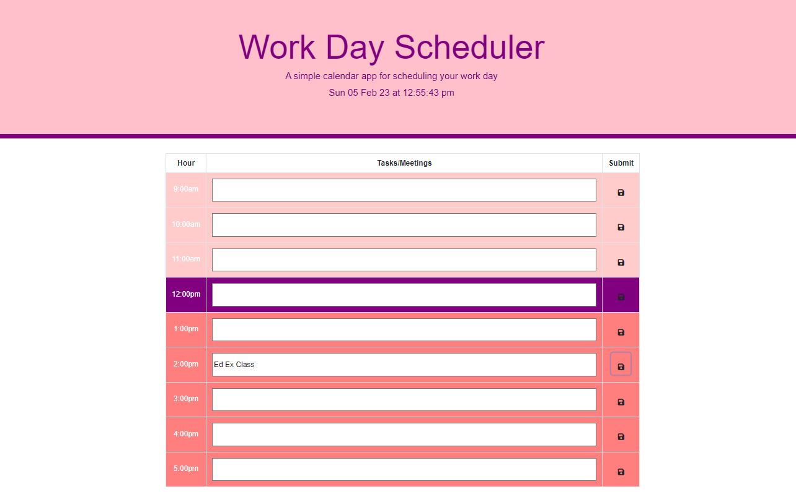

# Workday-Schedule-Javascript
A workday planner application with time and calender functionality. 

Create a day schedule application where users can input hourly tasks and save them.
These tasks should persist if the user leaves or refreshes the page.

Input your daily tasks to stay organised!

Link to live site: https://laurencemb.github.io/Workday-Schedule-Javascript/

Screen shot of deployed site: screenshot of deployed wepage:
))

Installation N/A

Credits N/A

License MIT
